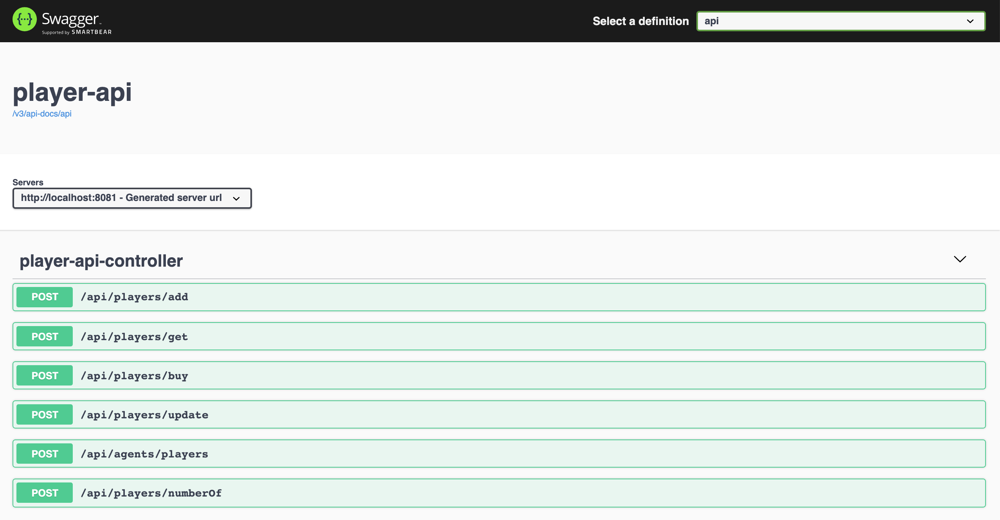

# ethereum-springboot-react

The project goals are:

1. Implement an **Ethereum Smart Contract** called `SoccerManager` (using [Solidity](https://solidity.readthedocs.io/en/latest) programming language) and deploy it to [Ethereum Blockchain](https://www.ethereum.org) running locally using [ethereum/client-go](https://github.com/ethereum/go-ethereum) docker image;

1. Implement two [`Spring Boot`](https://docs.spring.io/spring-boot/docs/current/reference/htmlsingle/) backend applications, `ethereum-api` and `player-api`, that uses [Web3j](https://docs.web3j.io/getting_started.html) library to communicate with Ethereum blockchain;

1. Implement two [`ReactJS`](https://reactjs.org/) frontend applications, `ethereum-ui` and `player-ui`, that communicate to their respective backend application.

## Ethereum Smart Contract

`Ethereum Smart Contract` is a program that runs on an `EVM` (`Ethereum Virtual Machine`) similar to a Java program that runs on `JVM` (`Java Virtual Machine`). A contract is a collection of code (its functions) and data (its state) that resides at a specific address on the Ethereum Blockchain. Ethereum Smart Contracts are usually written in `Solidity` programming language.

In order to implement smart contracts we used [Remix](https://remix.ethereum.org). It's a powerful, open source tool that helps you write contracts using Solidity straight from the browser.

- **SoccerManager**

  `SoccerManager` is a smart contract that handles soccer players. Once deployed, it has some pre-defined soccer players registered. Initially, the agent of those pre-defined players is the owner of the contract (the wallet address used to deploy the contract). Besides, only the owner of the contract can add players. Other wallets (agent wallets) can buy soccer players and, once it is done, the agent wallet becomes the owner of the player.

## Applications

- **ethereum-api**

  `Spring Boot`application that communicates with Ethereum Blockchain, using `Web3j` library. `ethereum-api` provides some endpoints to create a new wallet, transfer ether from one wallet to another, etc.

  

- **player-api**

  `Spring Boot` application that calls `SoccerManager` smart contract `public functions` using `Web3j`. It exposes some endpoints so that you can buy a player, get info about the player, add players, etc.

  Some endpoints, such `POST /api/players/add`, requires the use of the **owner contract wallet**, i.e, the wallet that was used to deploy `SoccerManager` smart contract.

  

- **ethereum-ui** (TODO)

  `ReactJS` frontend application that provides a User Interface so that we can create a wallet, check its balance, transfer ethereum to other wallets, etc.

- **player-ui** (TODO)

  `ReactJS` frontend application that provides a User Interface to easily play with Ethereum Blockchain and `SoccerManager` smart contract. Using `Web3j`, it listens to `PlayerAdded`, `PlayerUpdated` and `PlayerBought` event emitted from `SoccerManager` contract (and some other logs from Ethereum Blockchain) and updates the screen on-the-fly. Besides, `player-ui` communicates directly with `player-api` whenever it needs some information from `SoccerManager` contract.

## Prerequisites

- [`Java 11+`](https://www.oracle.com/java/technologies/downloads/#java11)
- [`Docker`](https://www.docker.com/)
- [`jq`](https://stedolan.github.io/jq)

## Run Ethereum locally

In a terminal, run the docker command below. It starts a container in development mode and exposes `Ethereum RPC API` on port `8545`.
```
docker run -d --rm --name ethereum \
  -p 8545:8545 -p 30303:30303 \
  ethereum/client-go:v1.9.25 \
  --rpc --rpcaddr "0.0.0.0" --rpcapi="db,eth,net,web3,personal" --rpccorsdomain "*" --dev
```

> Run the following `docker exec` command if you want to enter in the `Geth`’s interactive JavaScript console inside Docker container. It provides a lot of features such as: create an wallet, check waller balance, transfer ether from one address to another, etc. I won't focus on it because I decided to implement such features in `ethereum-api` using `Web3j`.
> ```
> docker exec -it ethereum geth attach ipc:/tmp/geth.ipc
> ```

## Compile Smart Contract

- Access https://github.com/web3j/web3j/releases/tag/v4.5.5 and download `web3j-4.5.5.zip`

- Unzip it to your preferred location

- In a terminal, navigate to `ethereum-springboot-react` root folder

- Export to `WEB3J_PATH` environment variable, the absolute path of `Web3j` where you have unzipped
  ```
  export WEB3J_PATH=path/to/web3j-4.5.5
  ```

- Run the following script. It will compile Solidity `SoccerManager` code, `solidity/SoccerManager.sol`. When the compilation finishes, it will produce the files: `solidity/SoccerManager.abi` and `solidity/SoccerManager.bin`. Then, the script uses these two files to generate the `SoccerManager.java` in `ethereum-api` and `player-api`. 
  ```
  ./compile-generate-soccermanager.sh
  ```

## Start applications & deploy Smart Contract

- ### Start ethereum-api

  - Open a new terminal and nagivate to `ethereum-springboot-react/ethereum-api` folder
  
  - Run following command to start application
    ```
    ./mvnw clean spring-boot:run
    ```

  - Wait for it to start before continuing

- ### Deploy Smart Contract

  - In a terminal, make sure you are inside `ethereum-springboot-react` root folder

  - Create the `contract owner` wallet
    ```
    CONTRACT_OWNER_WALLET=$(curl -s -X POST "http://localhost:8080/api/wallets/create" \
      -H "Content-Type: application/json" \
      -d "{ \"password\": 123, \"initialBalance\": 10000000000000000000}" | jq '.')
    CONTRACT_OWNER_WALLET_FILE=$(echo $CONTRACT_OWNER_WALLET | jq -r '.file')
    CONTRACT_OWNER_WALLET_ADDR=$(echo $CONTRACT_OWNER_WALLET | jq -r '.address')
    ```

  - To check `contract owner` wallet
    ```
    echo "CONTRACT_OWNER_WALLET=$CONTRACT_OWNER_WALLET"
    echo "CONTRACT_OWNER_WALLET_FILE=$CONTRACT_OWNER_WALLET_FILE"
    echo "CONTRACT_OWNER_WALLET_ADDR=$CONTRACT_OWNER_WALLET_ADDR"
    ```

  - Deploy `SoccerManager` contract using the `contract owner` wallet
    ```
    ETHEREUM_CONTRACT_SOCCERMANAGER_ADDRESS=$(curl -s \
      -X POST "http://localhost:8080/api/contracts/deploy/soccerManager" \
      -H "Content-Type: application/json" \
      -d "{ \"password\": 123, \"file\": \"$CONTRACT_OWNER_WALLET_FILE\", \"gasPrice\": 1, \"gasLimit\": 3000000 }")
    ```
    
  - To check `SoccerManager` contract address
    ```
    echo "ETHEREUM_CONTRACT_SOCCERMANAGER_ADDRESS=$ETHEREUM_CONTRACT_SOCCERMANAGER_ADDRESS"
    ```

- ### Start player-api

  - Open a new terminal and navigate to `ethereum-springboot-react/player-api` folder
  
  - Export to `ETHEREUM_CONTRACT_SOCCERMANAGER_ADDRESS` environment variable the `SoccerManager` contract address obtained at [Deploy Smart Contract](#deploy-smart-contract) step
    ```
    export ETHEREUM_CONTRACT_SOCCERMANAGER_ADDRESS=...
    ```
  
  - Run following command to start application
    ```
    ./mvnw clean spring-boot:run
    ```

## Application URLs

| Application    | URL                                   |
| -------------- | ------------------------------------- |
| `ethereum-api` | http://localhost:8080/swagger-ui.html |
| `player-api`   | http://localhost:8081/swagger-ui.html |

## Test player-api

- In a terminal, run the following commands to create `new agent` wallet
  ```
  NEW_AGENT_WALLET=$(curl -s -X POST "http://localhost:8080/api/wallets/create" \
    -H "Content-Type: application/json" \
    -d "{ \"password\": 123, \"initialBalance\": 10000000000000000000}" | jq '.')
  NEW_AGENT_WALLET_FILE=$(echo $NEW_AGENT_WALLET | jq -r '.file')
  NEW_AGENT_WALLET_ADDR=$(echo $NEW_AGENT_WALLET | jq -r '.address')
  ```
  
- To check `new agent` wallet
  ```
  echo "NEW_AGENT_WALLET = $NEW_AGENT_WALLET"
  echo "NEW_AGENT_WALLET_FILE = $NEW_AGENT_WALLET_FILE"
  echo "NEW_AGENT_WALLET_ADDR = $NEW_AGENT_WALLET_ADDR"
  ```

- Get player with id `1` using `new agent` wallet
  ```
  curl -s -X POST "http://localhost:8081/api/players/get" \
    -H "Content-Type: application/json" \
    -d "{ \"password\": 123, \"file\": \"$NEW_AGENT_WALLET_FILE\", \"gasPrice\": 1, \"gasLimit\": 3000000, \"playerId\": 1}" | jq '.'
  ```

- Buy player with id `1` using `new agent` wallet
  ```
  curl -s -X POST "http://localhost:8081/api/players/buy" \
    -H "Content-Type: application/json" \
    -d "{ \"password\": 123, \"file\": \"$NEW_AGENT_WALLET_FILE\", \"gasPrice\": 1, \"gasLimit\": 3000000, \"playerId\": 1, \"weiValue\": 1000000000000000000}" | jq '.'
  ```

- Get the players `new agent` has
  ```
  curl -s -X POST "http://localhost:8081/api/agents/players" \
    -H "Content-Type: application/json" \
    -d "{ \"password\": 123, \"file\": \"$NEW_AGENT_WALLET_FILE\", \"gasPrice\": 1, \"gasLimit\": 3000000}" | jq '.'
  ```

## Shutdown

- To stop `ethereum-api` and `player-api`, just to got the terminals where they are running and press `Ctrl+C`
- To stop `ethereum/client-go` docker container, run the following command in a terminal
  ```
  docker stop ethereum
  ```

## TODO

- implement `ethereum-ui` and `player-ui`

## References

- https://piotrminkowski.wordpress.com/2018/06/22/introduction-to-blockchain-with-java-using-ethereum-web3j-and-spring-boot/
- https://piotrminkowski.wordpress.com/2018/07/25/intro-to-blockchain-with-ethereum-web3j-and-spring-boot-smart-contracts/
